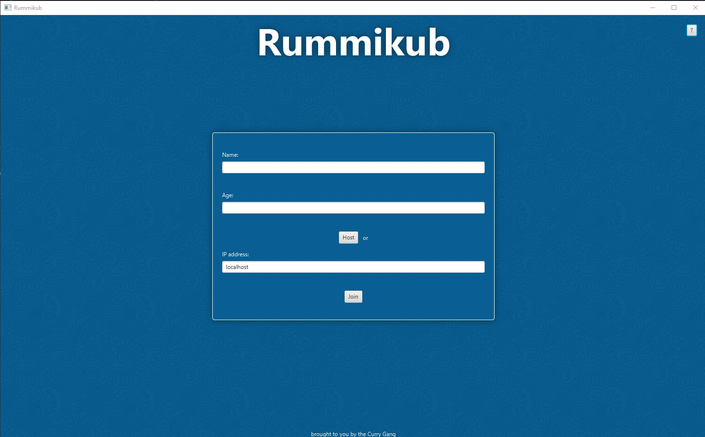
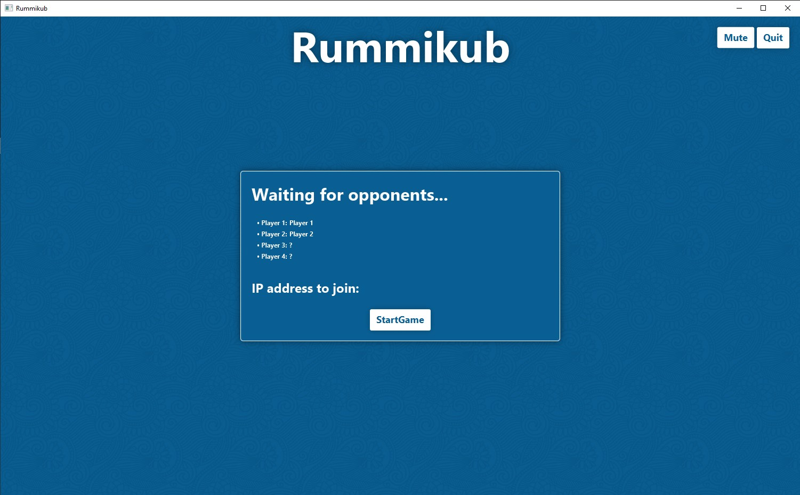
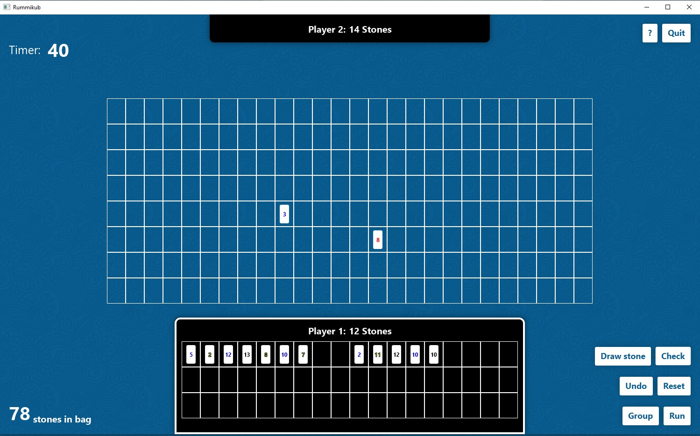

# Rummikub Multiplayer

To open the application there must be a Java Version installed at your computer.



There is a jar file at: /Abgaben/final_jar

To run the application you have to give the following command in the command line:
```java -jar final_jar.jar```

Then you have to enter your data and either host a new game or join another lobby using the lobbys URL.



The host of the lobby can start the game. Once the game starts, each player has a 1 minute to either play or lose their turn.

